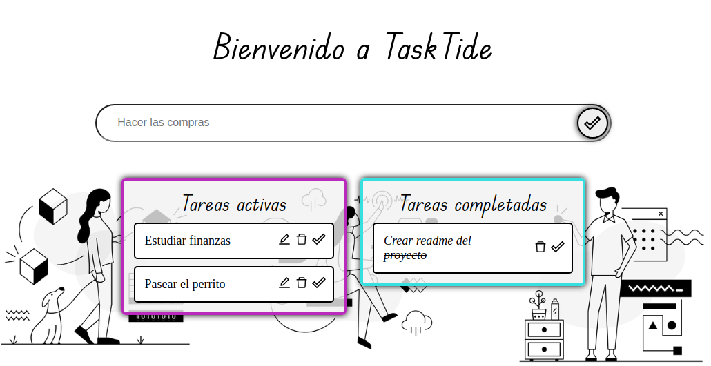
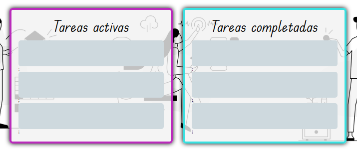

<h1 align="center">TaskTide</h1>
</img>

   
   
   
   
   
   
   
   

<h2>Introduction</h2>

TaskTide is a notes application designed to make it easier to manage your tasks and schedules. Provides a quick and easy experience to keep track of important data, messages, shopping list, things to do, etc. Functionally, drag and drop usage of react-beautiful-dnd was implemented for greater interactivity, react-icons for the use of icons, localStorage for data persistence, and a loading skeleton to simulate tasks during the loading state.

</img>

<h2>Description</h2>

Initially you will see an entry in which you must enter your tasks, these can be displayed in the <em>Active Tasks</em> container. In addition, there is a second container in which the <em>Completed Tasks</em> will be displayed.

<h3>TaskTide has different functionalities:</h3>

<ul>
   <li> ✏️ Edit tasks (input that will be displayed in the task card to be edited), as long as the task is not in the <em>Completed Tasks</em> container.</li>
   <li> 🗑️ Delete tasks.</li>
   <li> ✔️ Complete tasks (you can use this functionality by pressing the isDone icon or simply dragging the task you want to the <em>Completed Tasks</em> container).</li>
</ul>

https://github.com/genepatino/tasktide-proyect/assets/62777013/ca4d131f-a197-41e5-9252-241698b37bcb

On your right, in the About section, you will find the link to the application.

<em>Thanks for watching🌸</em>

<h3>Author:</h3>
Génesis Patiño

</img>
